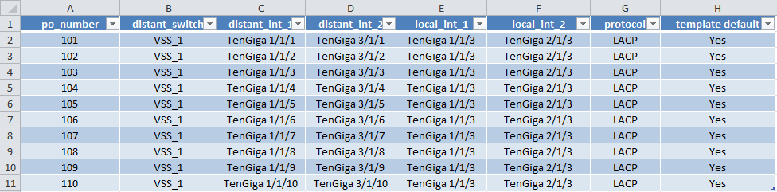
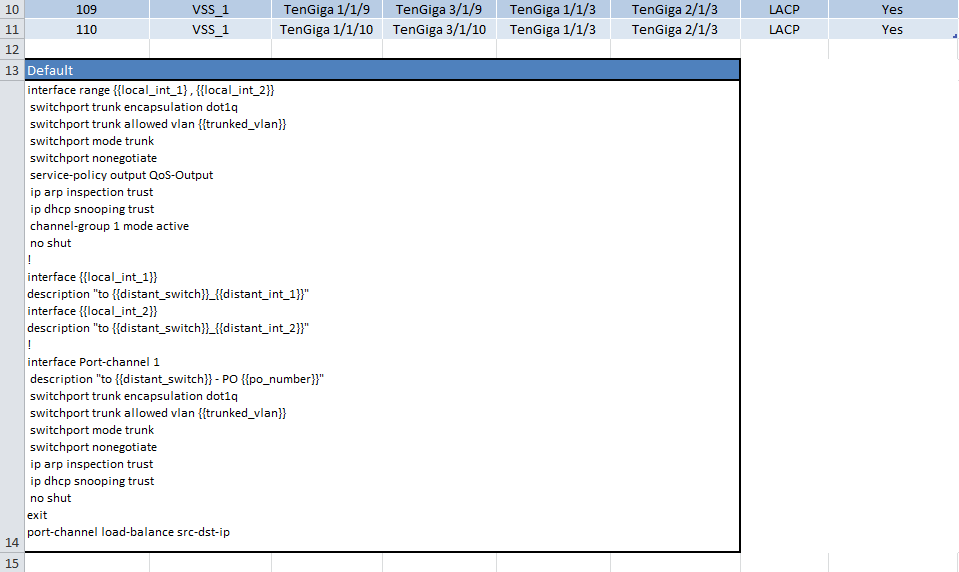

The Excel Workbook
------------------------
The Excel Workbook has to be built in a specific way in order to allow NetScriptGen to be able to identify the data in a structured manner.
The Excel Workbook will contains:

* **A global worksheet named 'Global'**: this is the main worksheet, it contains equipments per row, and the variables per column 
* **A worksheet per feature**: this is the worksheet which contains the data of the specified feature (VLAN, VTP, Port-Channel, and so on) 
* **A set of worksheets**: they contain fixed common variables (DNS, banner, user and so on)

The global worksheet
~~~~~~~~~~~~~~~~~~~~~~~

1. Open Microsoft Excel

2. Renames the first sheet by 'Global'.

3. On the first row, fill the cells with your variables. For example: hostname, location, layer, equipment, stack, ip_mgmt, vtp_profile, engine_id, port-channel

4. Then, from the second row, each row is an equipement, fill the cells with the appropriate value

You can see an example of a global worksheet below :

.. figure:: _static/global_sheet.png
   :alt: global worksheet overview

   Figure 1, An Example of a global worksheet

As you can see above, each line is an equipment. Each of these equipments will have a configuration different from one another based on the values of the variables.
You can add equipment and variable by inserting rows and columns respectively as much as you want. The only limit is the maximum number of rows and columns set by Microsoft.
Of course, the more equipments and variables there are, the slower will be NetScriptGen to generate the scripts.

In this global worksheet, the variables may be simple or complex :

* **the simple variable** : NetScriptGen will replace the variable within double brackets ``{{variable}}`` by the value contained in the global worksheet. For instance, ``{{hostname}}`` will be replaced by ``SW1``

* **the complex variable** : if there is a worksheet which its label is a variable, then this variable is a complex one and the worksheet is called a "feature worksheet". In this case, NetScriptGen will not simply substitute the variable by the value, but it will replace the ``{{variable}}`` by one or more sub-templates filled by values contained into the feature worksheet.

.. note:: From now on, I will take the first equipment (SW1) as example.

The feature worksheet
~~~~~~~~~~~~~~~~~~~~~~~

Now you know what is a complex variable, we have to take a look on how to set up a feature worksheet.
We will do that for the variable ``port-channel`` which is now only a simple variable.

1. Create a new woorksheet and labeled it ``port-channel`` (case-sensitive).

Therefore, ``port-channel`` is a complex variable.
Now, This worksheet must be divided into two sections:

* **The table that contains the data**
* **The sub-templates**

2. Create your table as you did for the global worksheet **BUT** in the first column you must put all the values that may take the complex variable. As you may have guessed, this is the joint connecting the global worksheet and the feature sheet.

   Figure 2, An Example of a feature worksheet

3. Then below the table, create one or more sub-templates. 
	1. Into the cell, enter title of the sub-template
 	2. Into the cell just below write ALL the sub-template (Alt+Enter to wrap to the next line)
   Repeat the point 3. as many times as the number of sub-template you want.

.. warning:: There must be at least one blank-line between the table and the sub-templates

   Figure 3, An Example of a sub-template

.. warning:: As you can see above, the title of the template "Default" is in the cell A13, and the template itself is in the cell A14.
          You can then merge cells as I did, but the content must be is the column A.

The complex variable ``{{port-channel}}`` in the global template will be substitute by :

.. code-block:: none
   :emphasize-lines: 3,20

   interface range TenGiga1/1/3, TenGiga1/1/3
   switchport trunk encapsulation dot1q
   switchport trunk allowed vlan 101,401,51,61
   switchport mode trunk
   switchport nonegotiate
   service-policy output QoS-Output
   ip arp inspection trust
   ip dhcp snooping trust
   channel-group 1 mode active 
   no shut
   !
   interface TenGiga1/1/3
   description "to VSS_1_TenGiga3/1/1"
   interface TenGiga1/1/3
   description "to VSS_1_TenGiga3/1/2"
   !
   interface Port-channel 1
   description "to VSS_1 - PO 101"
   switchport trunk encapsulation dot1q
   switchport trunk allowed vlan 101,401,51,61
   switchport mode trunk
   switchport nonegotiate
   ip arp inspection trust
   ip dhcp snooping trust
   no shut
   exit
   port-channel load-balance src-dst-ip

.. note:: The variable ``{{trunked_vlan}}}`` has been replaced by ``101,401,51,61`` whereas it's a simple variable from the global worksheet. 
   To be short, you can reach the value of a variable from any worksheet. I clarify this into detail in the chapter template.

The joint between the global worksheet and a feature worksheet
~~~~~~~~~~~~~~~~~~~~~~~~~~~~~~~~~~~~~~~~~~~~~~~~~~~~~~~~~~~~~~

We know that pictures speak more than words, I drew an illustration to explain the joint between the global worksheet and a feature worksheet.

.. figure:: _static/global_to_feature_worksheet.png
   :alt: The joint between the global and the feature worksheet

   Figure 4, The joint between the global and the feature worksheet

Fixed common variables
~~~~~~~~~~~~~~~~~~~~~~
Although the configurations are different from one another, there are some fixed common variables. 
After all, you can put the values of these variables directly within the global template. However, fixed common variable gives you much more flexibility and clarity.
Indeed, if you want to reuse a old project, you just have to change the values of the variables in the worksheet, and not spending time scratching your head to change the values in the global template. The strength of a variable, no more, no less...

1. Create a new woorksheet and labeled it as you want

2. 
	1. In the cell A1, enter "Function"
	2. In the cell A2, enter "Variable"
	3. In the cell A3, enter "Value"

3. Then, for each row, enter the variable, its function and value

How to store a text ?
~~~~~~~~~~~~~~~~~~~~~~
Sometimes you need to store a text, the MOTD banner that displays when the user logs in to the switch for example.
To achieve this :

1. Create a new woorksheet and labeled it as you want

2. In the cell A1, enter "Text"

3. In the column A, choose a cell and enter the name of the variable that will contain the text

3. In the right cell, enter the value of the text
You can then merge cells, but the content must be in the rigth cell.

